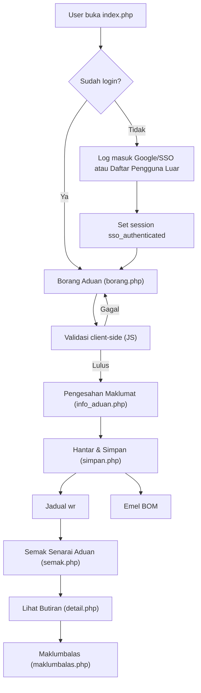

## Flow Aduan – Mermaid Preview

```mermaid
flowchart TD
    A["User buka index.php"] --> B{"Sudah login?"}
    B -->|Ya| C["Borang Aduan (borang.php)"]
    B -->|Tidak| D["Log masuk Google/SSO atau Daftar Pengguna Luar"]
    D --> E["Set session sso_authenticated"]
    E --> C

    C --> F["Validasi client-side (JS)"]
    F -->|Lulus| G["Pengesahan Maklumat (info_aduan.php)"]
    F -->|Gagal| C

    G --> H["Hantar & Simpan (simpan.php)"]
    H --> I["Jadual wr"]
    H --> J["Emel BOM"]
    I --> K["Semak Senarai Aduan (semak.php)"]
    K --> L["Lihat Butiran (detail.php)"]
    L --> M["Maklumbalas (maklumbalas.php)"]
```

